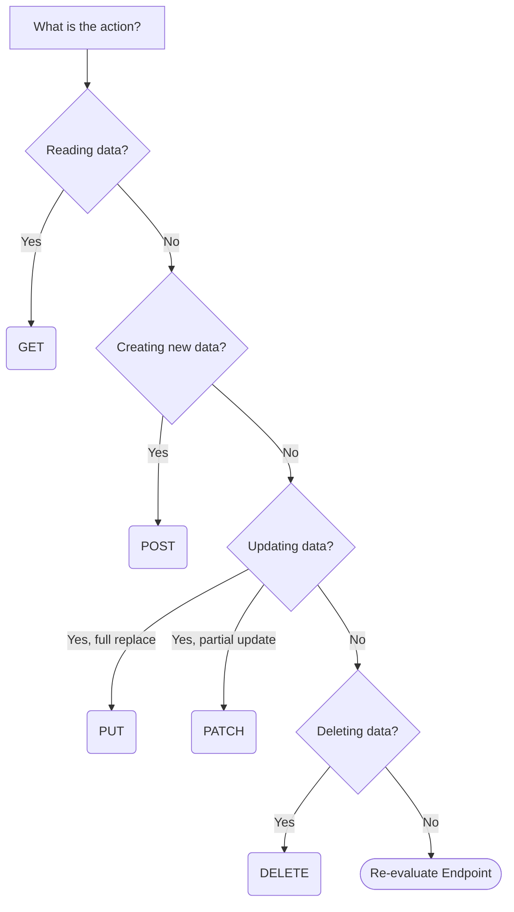

# API & Design Naming Conventions

## 1. Database Conventions (Supabase & SQL)

Consistent database schema naming prevents mapping errors between the database and the application layer.

* **Tables:** Use lowercase, plural nouns in snake_case (e.g., `users`, `workspaces`, `billing_profiles`).
* **Columns:** Use lowercase snake_case (e.g., `first_name`, `created_at`).
* **Primary Keys:** Always use `id` as the primary key column name (UUIDs preferred).
* **Foreign Keys:** Use the singular table name followed by `_id` (e.g., `user_id`, `workspace_id`).
* **Booleans:** Prefix with `is_`, `has_`, or `can_` to make the type obvious (e.g., `is_active`, `has_pro_tier`).
* **Timestamps:** Standardize on `created_at` and `updated_at` (defaulting to `now()`).
* **Indexes/Constraints:** Name explicitly based on table and columns (e.g., `idx_users_email`, `fk_workspaces_owner_id`).

---

## 2. API Design Conventions

Endpoints should represent **resources** (nouns), not **actions** (verbs). We use JSON for all data payloads.

* **Base URL:** `https://api.codewaft.com/v{major_version}/{resource}` (e.g., `/v1/users`).
* **Routing:** Use lowercase, plural nouns in kebab-case (e.g., `/v1/user-profiles`). Sub-resources should be nested logically (e.g., `/v1/users/{user_id}/posts`).
* **Payload Casing:** Use `camelCase` for all JSON keys in requests and responses. 

### Standard Response Format

Always return a consistent structure to simplify client-side parsing.

**Success Response:**
```json
{
  "data": {
    "id": "123",
    "email": "hello@codewaft.com"
  },
  "error": null,
  "meta": {
    "timestamp": "2026-03-29T00:00:00Z"
  }
}
```

**Error Response:**
```json
{
  "data": null,
  "error": {
    "code": "unauthorized",
    "message": "Invalid or expired authentication token.",
    "details": {}
  }
}
```

### HTTP Methods Decision Graph



---

## 3. Query Parameters (Pagination, Filtering, Sorting)

Query parameters should conventionally use `camelCase` to align with the JSON payload keys in JS/TS environments.

* **Pagination:** Use `page` and `limit` for offset-based (e.g., `?page=1&limit=20`), or `cursor` and `limit` for cursor-based pagination. Add `meta` to the response payload to return total counts or next cursors.
* **Filtering:** Use exact field matches (e.g., `?status=active`). Use bracket notation for operators (e.g., `?createdAt[gte]=2024-01-01`).
* **Sorting:** Use `sort` or `sortBy`. Prefix with `-` for descending order (e.g., `?sort=-createdAt,name`).

---

## 4. HTTP Status Codes

Standardize API responses using proper conceptual mapping to HTTP status codes:

* **20x (Success):**
  * `200 OK`: Request succeeded.
  * `201 Created`: Resource successfully created (usually POST).
  * `204 No Content`: Request succeeded, but no data to return (often DELETE or successful PUT/PATCH without payload).
* **40x (Client Errors):**
  * `400 Bad Request`: Invalid parameters or malformed JSON.
  * `401 Unauthorized`: Missing or invalid authentication token.
  * `403 Forbidden`: Authenticated, but lacks permissions for the resource.
  * `404 Not Found`: Resource or endpoint does not exist.
  * `422 Unprocessable Entity`: Schema validation errors.
  * `429 Too Many Requests`: Rate limit exceeded.
* **50x (Server Errors):**
  * `500 Internal Server Error`: Unexpected server-side issue.

---

## 5. Headers & Authentication

* **Auth Tokens:** Pass JWT or bearer tokens in the `Authorization` header: `Authorization: Bearer <token>`.
* **Custom Headers:** Prefix custom headers with `X-` using Train-Case conventions (e.g., `X-Workspace-Id`, `X-Idempotency-Key`).
* **Idempotency:** For critical POST/PATCH requests (like payments or resource duplication), require an `X-Idempotency-Key` header to prevent duplicate operations on network retries.

---

## 6. Webhooks Naming Convention

* **Event Naming:** Use `resource.action` syntax in lowercase (e.g., `user.created`, `user.updated`, `invoice.payment_failed`).
* **Payloads:** Include an event ID, type, timestamp, and a `data` object containing the relevant resource state.

---

## 7. Code Casing Standards

To keep the codebase readable, stick to these universal casing rules:

* **`PascalCase`**: Classes, Types, Interfaces, and React Components (e.g., `class UserAccount`, `type UserProfile`, `function DashboardMenu()`).
* **`camelCase`**: Variables, instances, and standard functions (e.g., `const userData`, `function calculateTotal()`).
* **`UPPER_SNAKE_CASE`**: Global constants and environment variables (e.g., `MAX_RETRY_ATTEMPTS`, `SUPABASE_URL`).
* **`kebab-case`**: File and folder names whenever possible, unless framework conventions dictate otherwise (e.g., `utils/format-date.ts`).