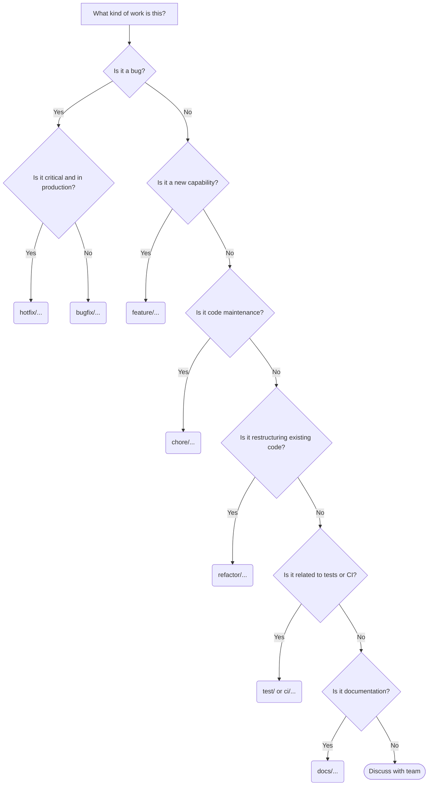

# Git Branch Naming Convention (v1)

A clean, consistent branching strategy helps us track work, trace bugs, keep our repository organized, and streamline our CI/CD pipelines.

## The Core Structure

All branches should follow this standardized format:

`<type>/<issue-number>-<short-description>`

*(Note: Omit `<issue-number>` if the work is not linked to a specific ticket, though linking branches to tickets is highly recommended.)*

### Optional: Personal or Team Prefixes
In larger teams, you may optionally prefix the description with your initials or username to easily identify branch owners:
`<type>/<username>/<issue-number>-<short-description>`
(e.g., `feature/sk/cw-12-auth`)

## Formatting Rules

1. **Lowercase Only:** Never use uppercase letters (e.g., `feature`, not `Feature`).
2. **Kebab-case:** Use hyphens (`-`) to separate words. No underscores or spaces.
3. **Keep it Concise:** The description should be short but clear enough to understand without looking at the commit history (e.g., `add-stripe-webhook`, not `adding-the-webhook-for-stripe-payments-to-work`).
4. **Alphanumeric Only:** Avoid punctuation or special characters in the description.

## Branch Types

Aligned with standard Conventional Commits:

* **`feature/`** or **`feat/`**: Building new capabilities, enhancements, or adding new features.
* **`bugfix/`** or **`fix/`**: Resolving bugs or issues found during development or testing.
* **`hotfix/`**: Urgent, critical fixes deployed directly to production.
* **`chore/`**: Maintenance tasks, dependency updates, or configuration changes (no production code changes).
* **`refactor/`**: Code changes that neither fix a bug nor add a feature (e.g., restructuring, changing architecture).
* **`test/`**: Adding missing tests or correcting existing tests.
* **`docs/`**: Updates to the README, wikis, or other documentation.
* **`ci/`**: Changes to our CI configuration files and scripts (e.g., GitHub Actions, Gitlab CI).
* **`release/`**: Used for preparing a new production release (usually branching off `develop` and merging into `main`).

## Examples

* `feature/cw-12-betterauth-integration`
* `bugfix/cw-45-supabase-env-vars`
* `refactor/jwt-utility-functions`
* `chore/update-api-docs`
* `hotfix/database-connection-timeout`
* `ci/add-linting-action`

---

## Branch Lifecycle & Cleanup

1. **Keep Branches Short-Lived:** Try to merge branches back to the main development line within a few days to avoid massive merge conflicts.
2. **Draft/WIP PRs:** If you need to push a branch to trigger CI or share work before it's ready, open a **Draft Pull Request** or prefix the PR title with `WIP:`.
3. **Delete After Merge:** Branches should be automatically deleted by the repository settings once their Pull Request is successfully merged.

---

## Decision Graph: Choosing a Branch Name

Use the following flowchart to determine the correct prefix for your branch:

