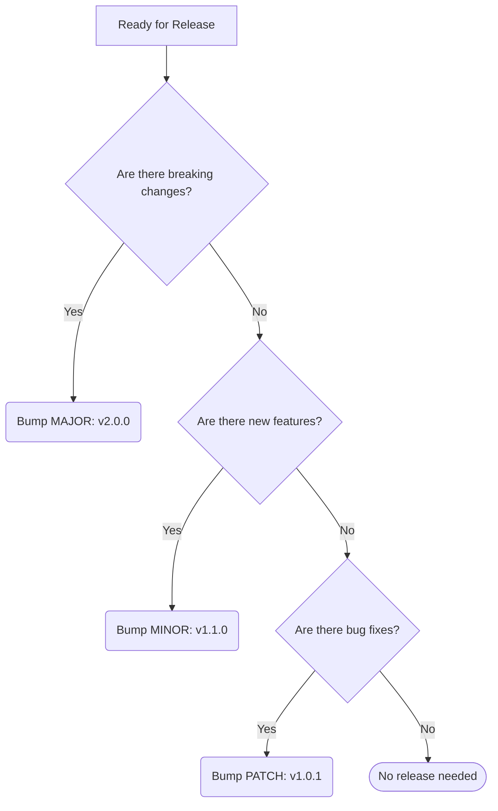

# Release Naming Conventions (v1)

Predictable release naming helps us track what is deployed in any given environment and safely roll back if something goes wrong. We strictly follow [Semantic Versioning (SemVer)](https://semver.org/).

## 1. The Core Format

All releases and Git tags must use the following structure:

`v<MAJOR>.<MINOR>.<PATCH>[-<PRE-RELEASE>]`

* **Always use the `v` prefix:** e.g., `v1.2.4`, not `1.2.4`.
* **No leading zeros:** e.g., `v1.0.5`, not `v01.00.05`.

## 2. Versioning Rules

Determine which number to bump based on the types of changes included in the release:

* **v0.x.x (Initial Development):** Anything may change at any time. The public API should not be considered stable.
* **MAJOR (`v2.0.0`):** Incompatible API changes, major architectural shifts, or breaking changes that require frontend/client updates.
* **MINOR (`v1.1.0`):** New features and capabilities added in a backwards-compatible manner.
* **PATCH (`v1.0.1`):** Backwards-compatible bug fixes, performance improvements, or minor chores.

## 3. Pre-Releases & Environments

When testing features before pushing to production, append a pre-release tag. 

* **`-alpha`:** Unstable work-in-progress, deployed to internal testing environments (e.g., `v1.2.0-alpha.1`).
* **`-beta`:** Feature-complete but undergoing QA/Staging testing (e.g., `v1.2.0-beta.1`).
* **`-rc` (Release Candidate):** The exact build expected to go to Production, pending final sign-off (e.g., `v1.2.0-rc.1`).

## 4. Release Branches & Hotfixes Workflow

* **Release Branches:** When preparing a release, group commits into a branch named `release/v<version>` (e.g., `release/v1.2.0`). This branch is used for final QA before merging to `main` and creating the tag.
* **Hotfixes:** Urgent production bugs are fixed on a branch directly off `main` (e.g., `hotfix/login-crash`). The fix is merged, a new `PATCH` version tag is created (e.g., `v1.2.1`), and the fix **must be backported** to the `develop` (or staging) branch.

## 5. Release Titles and Changelogs

* **GitHub/Gitlab Releases:** Keep titles exactly matching the tag name (`v1.2.0`) or simple and descriptive (`v1.2.0 - Stripe Billing`).
* **Changelogs:** Every release must update the `CHANGELOG.md` in the root repository. Group changes logically under standardized headers (e.g., `Features`, `Bug Fixes`, and `Breaking Changes`).

## 6. Version Bump Decision Graph

Use this logic to determine your next release tag:

## 7. Tying into Commits

Because we use Conventional Commits, version bumps can be largely automated:
* Commits starting with `feat:` trigger a **MINOR** bump.
* Commits starting with `fix:` trigger a **PATCH** bump.
* Commits with `BREAKING CHANGE:` in the footer or an exclamation mark `!` after the type/scope (e.g., `feat!:`) trigger a **MAJOR** bump.