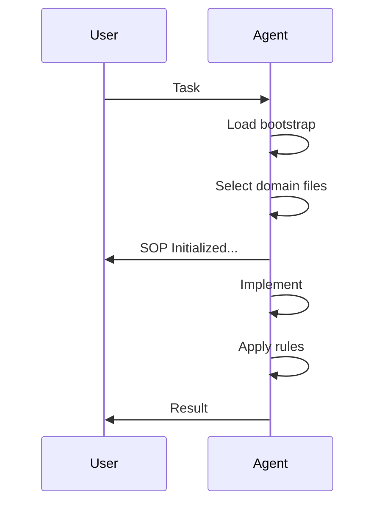

# 🤖 AI Agent Engineering Standards (AGENT.*)

[](#)
[](#)
[](#)
[](#)

> **Turn AI agents from code generators into disciplined engineers.**

---

## ⚡ TL;DR (Concise Version)

- Use `AGENT.bootstrap.md` → selects the right rules
- Always load `AGENT.md` (base)
- Add **one relevant domain file** (backend/frontend/llm/testing/devops)
- Avoid loading everything
- Initialize with:

```text
Follow AGENT.bootstrap.md, then load the required AGENT files.
Acknowledge and reply only with:
"SOP Initialized. What are we building today?"
```

👉 Result: safer, more consistent, production-grade outputs from AI agents

---

# 🚀 What is this?

A **modular SOP (Standard Operating Procedure)** for AI coding agents.

Instead of vague prompts, you provide:
- explicit engineering rules
- decision frameworks
- risk awareness
- anti-pattern detection
- output standards

👉 Think of it as an **engineering operating system for AI agents**

---

# 🧩 Files Overview

| File | Purpose |
|------|--------|
| `AGENT.md` | Global engineering rules (base layer) |
| `AGENT.backend.md` | Backend/API/database rules |
| `AGENT.frontend.md` | UI/state/UX rules |
| `AGENT.llm.md` | AI/LLM systems safety and design |
| `AGENT.testing.md` | Test strategy and verification rules |
| `AGENT.devops.md` | CI/CD, infra, deployment, reliability |
| `AGENT.bootstrap.md` | Selector for which rules to load |

---

# 🧠 How It Works (Architecture)

## Layered Instruction Model

```mermaid
flowchart TB
    A[User Task] --> B[AGENT.bootstrap.md]
    B --> C[AGENT.md (Base)]
    B --> D{Select Domain}
    D --> E[Backend]
    D --> F[Frontend]
    D --> G[LLM]
    D --> H[Testing]
    D --> I[DevOps]
    E --> J[Agent Execution]
    F --> J
    G --> J
    H --> J
    I --> J
    C --> J
    J --> K[High-Quality Output]
```

## Responsibility Map

```mermaid
flowchart LR
    Backend[Backend
(Data + Logic)] --> Quality
    Frontend[Frontend
(UX + State)] --> Quality
    LLM[LLM
(Safety + Control)] --> Quality
    Testing[Testing
(Verification)] --> Quality
    DevOps[DevOps
(Delivery + Runtime)] --> Quality
    Quality[Production-Grade System]
```

---

# ⚙️ How to Use

## 1) Start with Bootstrap
Use `AGENT.bootstrap.md` to choose the right files.

## 2) Load Base + Relevant Domain

- Backend → `AGENT.md` + `AGENT.backend.md`
- Frontend → `AGENT.md` + `AGENT.frontend.md`
- AI/LLM → `AGENT.md` + `AGENT.llm.md`
- Testing → `AGENT.md` + `AGENT.testing.md`
- DevOps → `AGENT.md` + `AGENT.devops.md`

## 3) Multi-domain (only if needed)
- API + UI → backend + frontend
- AI + API → llm + backend
- Feature + tests → domain + testing

👉 **Do NOT load all files by default**

## 4) Initialize

```text
Follow AGENT.bootstrap.md, then load the required AGENT files.
Acknowledge and reply only with:
"SOP Initialized. What are we building today?"
```

---

# 🛡️ What Problems This Solves

- inconsistent code
- missing edge cases
- unsafe LLM/tool usage
- weak testing
- risky deployments

---

# 🧪 Recommended Setup

- **AGENT files** → guidance
- **CI/CD** → enforcement
- **Tests** → validation
- **Code review** → final control

---

# 📈 When It Shines

- production systems
- multi-agent workflows
- large codebases
- AI-integrated products

---

# ⚠️ Principles

- Minimal rules + maximum relevance
- Do not overload context
- These guide behavior, not enforce it

---

# 🧾 Example Workflow



---

# 👤 Author

- **Serhat Kumas**
- GitHub: **https://github.com/SerhatKumas**
- LinkedIn: **https://www.linkedin.com/in/serhatkumas/**
- Website: **serhatkumas.github.io**

---

# 📝 Usage, Customization, and Responsibility

These files are provided as a practical starting point, not as universal or guaranteed-perfect rules.

Users are free to:
- modify them
- simplify them
- extend them
- adapt them to their company, team, stack, workflows, and risk tolerance

They are intentionally designed to be customized.

## Important Disclaimer
Use these files at your own discretion.

They are meant to improve engineering quality and agent behavior, but they do **not** guarantee correctness, security, compliance, uptime, or business suitability in every environment.

**I do not take responsibility for how these files are used, modified, interpreted, or applied in your systems, repositories, products, or organizations.**

They should always be combined with:
- sound engineering judgment
- code review
- testing
- CI/CD enforcement
- security review where appropriate

---

# 💬 Feedback and Improvements

Feedback, critique, suggestions, and improvement recommendations are very welcome.

If you see:
- weak spots
- unclear rules
- unnecessary complexity
- missing domains
- better patterns
- better examples
- better ways to reduce friction while preserving quality

please share them.

I am open to comments, corrections, and improvement recommendations.

---

# ⚠️ Token Usage Guidance

These `AGENT.*` files are intentionally detailed. That is one of their strengths, but it also creates a practical cost:

👉 **they can consume a significant amount of context / tokens**

Because of that, users and agents should be careful not to overload the instruction context unnecessarily.

## Recommended Token Discipline
- Always start with `AGENT.bootstrap.md`
- Always load `AGENT.md`
- Load only the domain-specific files that are actually relevant
- Avoid loading every AGENT file by default
- Prefer the smallest relevant rule set for the task
- For small tasks, use minimal instruction scope
- For larger tasks, combine files selectively and intentionally

## Practical Rule
**More rules do not always mean better results.**

Too much instruction context can make an agent:
- slower
- more rigid
- less focused
- more verbose
- less consistent on simple tasks

The correct strategy is:

👉 **minimal required rules + maximum relevance**

That is why `AGENT.bootstrap.md` exists.

---

# 🤝 Contributing

- adapt rules to your stack
- simplify where needed
- extend with new domains (architecture, security, data)
- improve clarity and reduce friction where possible

---

# 📌 Final Note

Used correctly, these standards:
- improve code quality
- reduce risk
- increase consistency

Used blindly, they:
- slow down agents
- reduce clarity

👉 Use them intentionally.

---

**Build like an engineer, not a prompt.**

